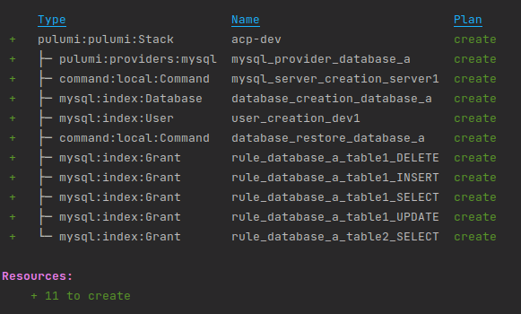
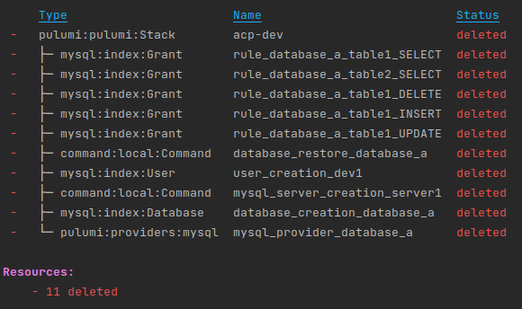

## ACP - Access control & permissions

ACP is a module that allows you to manage access control and permissions in MySQL databases.

This Pulumi script is designed to run as a cronjob in Kubernetes. On each run, the script downloads the ACP rules from an S3 bucket, applies them, and runs the required applications in the ACP rules.

Acp performs the following tasks:
- Download ACP rules from the Pulumi bucket.
- Depending on the rule configurations, it creates mysql services, restores databases, and applies configured permissions.
- It also configures database connections and runs the applications required in the ACP rules.
- If ACP rules are modified, the cronjob downloads and applies the changes.
- If an ACP rule is deleted, the cronjob deletes the mysql services, databases, and configured permissions.
- If an application is deleted from an ACP rule, the cronjob deletes the configured permissions for that application.
- If a database is deleted from an ACP rule, the cronjob deletes the configured permissions for that database.
- Any changes to the ACP rules are applied in the ACP cronjob.

To use the ACP script, you must configure the following environment variables:
- APP_NAME: Application name.
- PULUMI_BACKEND_URL: URL of the Pulumi bucket.
- PULUMI_CONFIG_PASSPHRASE: Password to decrypt the Pulumi configuration file.
- AWS_ACCESS_KEY_ID: AWS Access Key.
- AWS_SECRET_ACCESS_KEY: AWS Secret Access Key.
- AWS_DEFAULT_REGION: AWS Region.
- DEVELOPER_MYSQL_USER: MySQL user for the developer.
- DEVELOPER_NAMESPACE: Namespace for the developer.

In addition:
- Create a configuration map with the contents of the Kubernetes kubeconfig. This is used to be able to start applications and services in Kubernetes from within the ACP cronjob.
- Space for a data volume to store ACP configurations.


### How to get started

You can see an automatic example of how to use the ACP script in  [Acp](https://github.com/k8s-cicd-tools/deployment-acp-demo).

You can test it manually by running the ACP script in a Kubernetes pod that has Pulumi, awscli, kubectl and mysql-client installed. Following these steps:

1. Clone this repository inside the Kubernetes pod.
2. Copy the Kubernetes kubeconfig in the Kubernetes pod to the /root/.kube/config path.
3. Create the Pulumi bucket in S3.
4. Configure the environment variables.
5. Run `$ npm install`
6. Configure the Pulumi stack.
7. This is an example of the content of the rules file, mysqlServers.json
```
[
    {
        "name": "server1",
        "ip": "server1",
        "port": 3306
    }
]
```
8. Upload this rules file to the Pulumi bucket.
```
aws s3 cp mysqlServers.json ${pulumiBackendUrl}/acp/rules/mysqlServers.json
```
9. This is an example of the content of the rules file, databases.json
```
[
    {
        "serverName": "server1",
        "name": "database_a",
        "restoreFileName": "db.sql",
        "tables": [
            {
                "name": "table1"
            },
            {
                "name": "table2"
            },
            {
                "name": "table3"
            }
        ]
    }
]
```
10. Upload this rules file to the Pulumi bucket.
```
aws s3 cp databases.json ${pulumiBackendUrl}/acp/rules/databases.json
```
11. This is an example of the content of the rules file, userRules.json
```
[
  {
    "namespace": "test",
    "appName": "demo1",
    "databaseName": "database_a",
    "tables": [
      {
        "name": "table1",
        "actions": [
          "SELECT",
          "INSERT",
          "UPDATE",
          "DELETE"
        ]
      },
      {
        "name": "table2",
        "actions": [
          "SELECT"
        ]
      }
    ]
  },
  {
    "namespace": "test",
    "appName": "demo2",
    "databaseName": "database_a",
    "tables": [
      {
        "name": "table1",
        "actions": []
      },
      {
        "name": "table2",
        "actions": [
          "SELECT",
          "INSERT"
        ]
      },
      {
        "name": "table3",
        "actions": []
      }
    ]
  }
]
```
12. Upload this rules file to the Pulumi bucket.
```
aws s3 cp userRules.json ${pulumiBackendUrl}/acp/rules/userRules.json
```
13. Run `$ pulumi up` to create the mysql services, restore the databases and apply the configured permissions.
.
14. Verify that the mysql services, databases and configured permissions have been created correctly.
15. Change the content of the rules files and upload them again to the Pulumi bucket.
16. Run `$ pulumi up` to apply the changes and verify that the changes have been applied correctly.
17. Run `$ pulumi destroy` to delete the mysql services, databases and configured permissions."
.

### Resources.

db.sql: It is a file with the database structure and data. It is used to restore the database.

```
SET NAMES utf8;
SET time_zone = '+00:00';
SET foreign_key_checks = 0;
SET sql_mode = 'NO_AUTO_VALUE_ON_ZERO';

SET NAMES utf8mb4;

DROP TABLE IF EXISTS `table1`;
CREATE TABLE `table1` (
  `f1` int NOT NULL,
  `f2` int NOT NULL,
  `f3` int NOT NULL
) ENGINE=InnoDB DEFAULT CHARSET=utf8mb4;


DROP TABLE IF EXISTS `table2`;
CREATE TABLE `table2` (
  `f1` int NOT NULL,
  `f2` int NOT NULL,
  `f3` int NOT NULL
) ENGINE=InnoDB DEFAULT CHARSET=utf8mb4;


DROP TABLE IF EXISTS `table3`;
CREATE TABLE `table3` (
  `f1` int NOT NULL,
  `f2` int NOT NULL,
  `f3` int NOT NULL
) ENGINE=InnoDB DEFAULT CHARSET=utf8mb4;
```
